# 🎨 Skylanders Vibrancy Collection for ReShade

A collection of lightweight ReShade presets for games in the Skylanders series designed to inject vibrant colors, restore contrast and sharpen the game's image for use with emulators.

Tested with Dolphin Emulator and Cemu.

Feel free to modify these presets yourself in any way you wish! Note that if you wish to use depth buffer effects (like MXAO or RTGI) with the preset, you'll have to install the Addon-compatible version of ReShade instead. You can download the latest add-on build directly from the [Official ReShade Homepage](https://reshade.me/).

> 📝**Note For Modifying The Presets:** You are free to modify the preset in any way you'd like, and even distribute your modified presets. All I ask is that if you do use one of my presets as a baseline, or you use it in a YouTube video or stream, I would be very grateful if you can credit me and link back to this repository :)

Have fun!

## 📦 Installation Guide

### 1. Install ReShade
1. Download the latest version of ReShade from [reshade.me](https://reshade.me).
2. Run the installer and follow the instructions from the setup wizard. **Make sure to point the installer to your emulator, NOT YOUR GAME FILE.**
3. Make sure the Graphics Backend you select matches that of your emulator (e.g. if your graphics backend in your emulator is Vulkan, be sure to select Vulkan in the installer).
4. Install the following shader packs when prompted:
   - Standard Effects
   - SweetFX by CeeJay.dk
   - GShade-Shaders by Marot
   - FXShaders by luluco250
   - Shaders by brussell
   Or Select All (if you are going to be modifying the presets yourself, I highly recommend this).

### 2. Install the Presets
1. Go to the **Releases** section and install the preset **(`.ini`)** file for the game you want to play.
2. Move the preset into the folder where your emulator's **`.exe`** file is located (the same place you extracted ReShade previously).

### 3. How to Apply
1. Launch the game. ReShade should begin to compile the **`.fx`** files you installed previously.
2. Once compiled, press the hotkey used to open the menu (Default is **HOME**).
3. Look at the top of the ReShade menu and click the dropdown menu. If installed correctly, the presets will be available to select.
4. Wait for the preset to load fully, and enjoy your new vibrant game!

## 📺 Showcase

Click to view screenshots (Before/After)

### 🌀 Skylanders: Spyro's Adventure

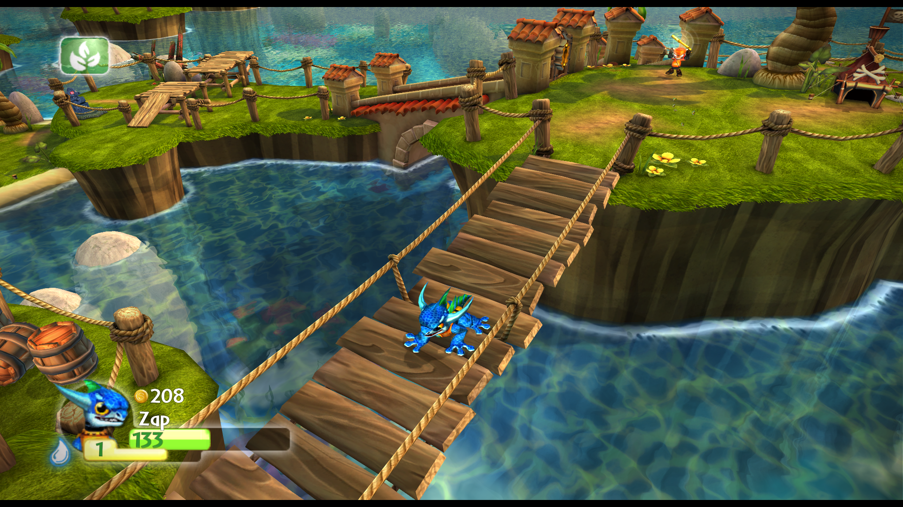 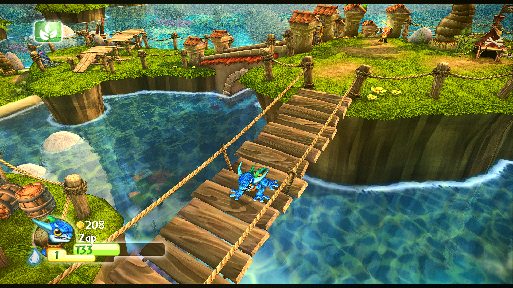

### 💪 Skylanders: Giants

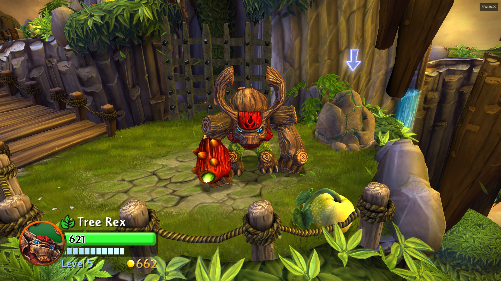 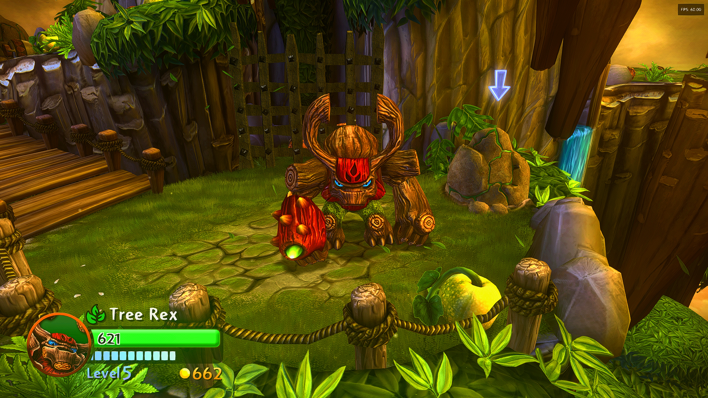

### 🔄 Skylanders: SWAP Force

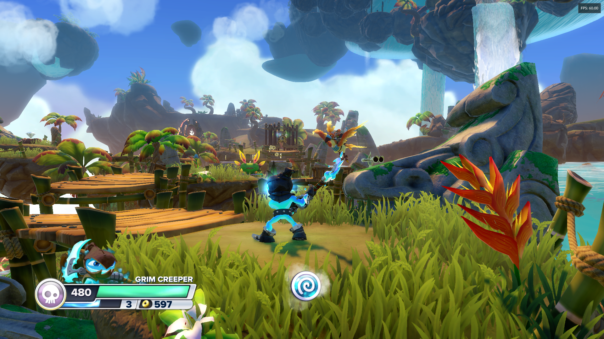 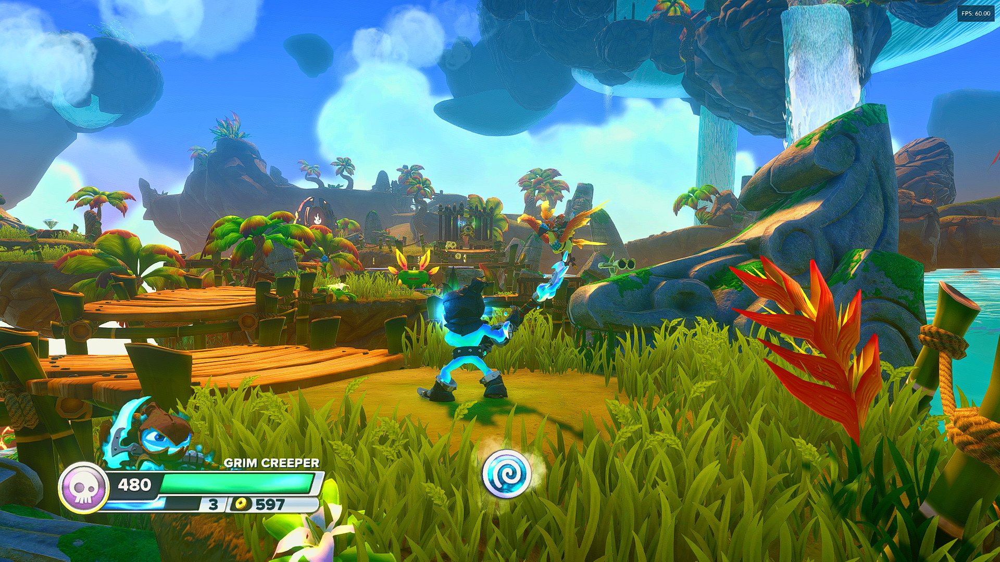

### 💎 Skylanders: Trap Team

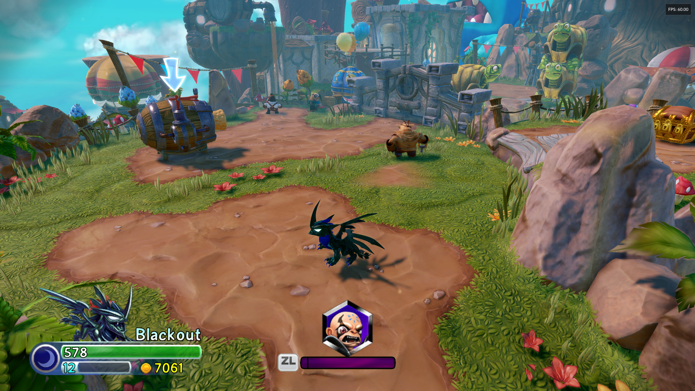 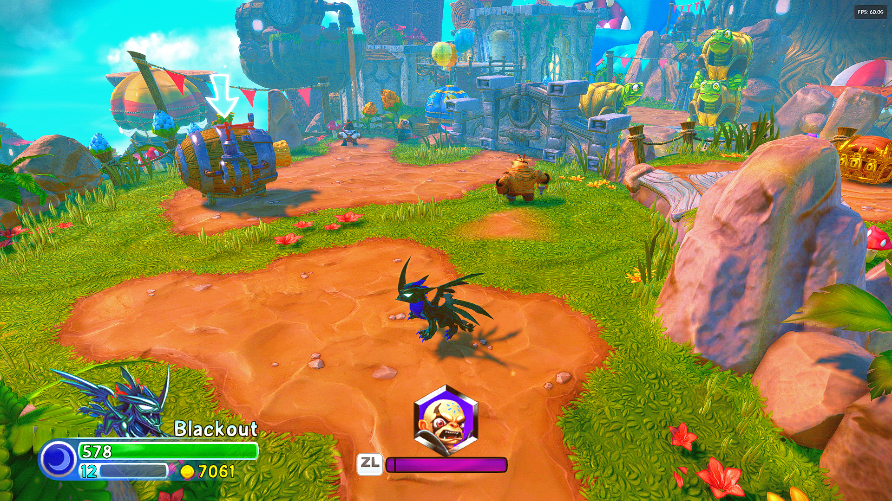

### ⚡Skylanders: Superchargers

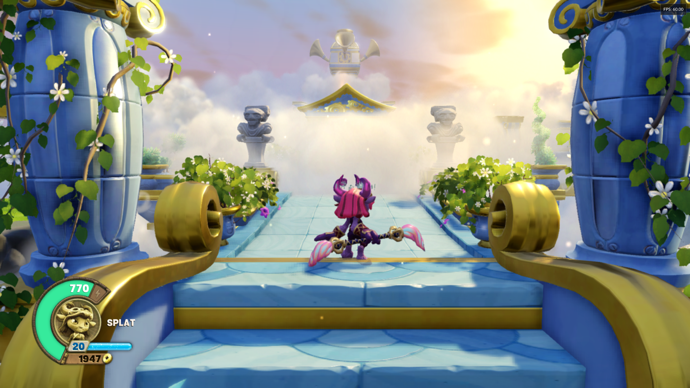 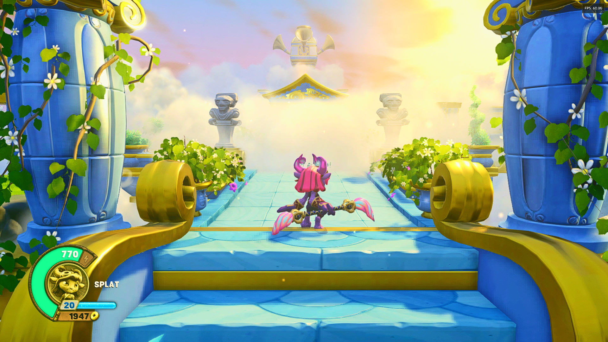

### 🏁 Skylanders: Superchargers Racing

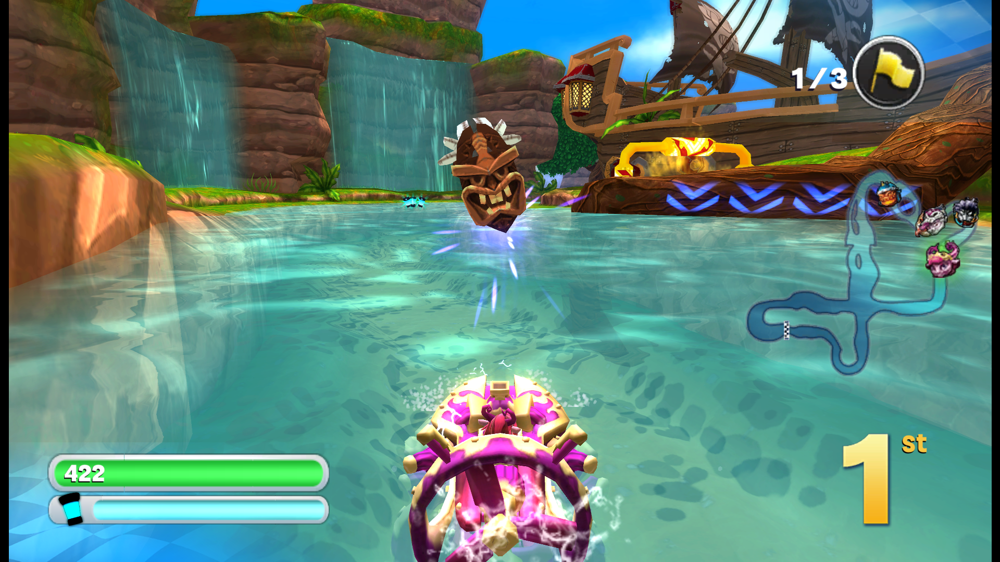 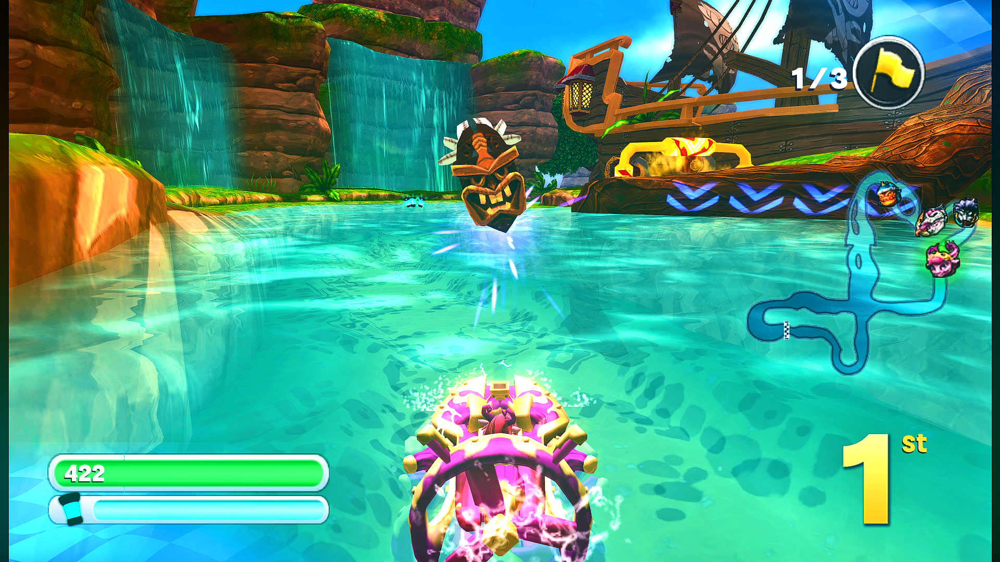
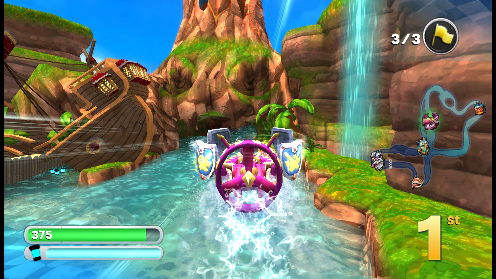 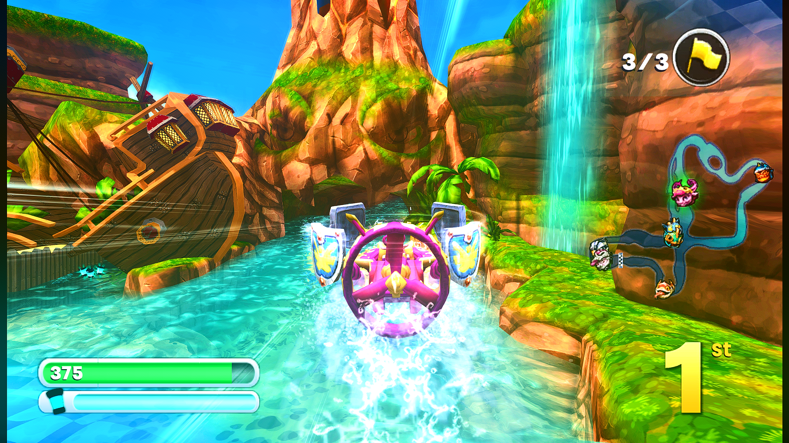

### 🔮 Skylanders: Imaginators

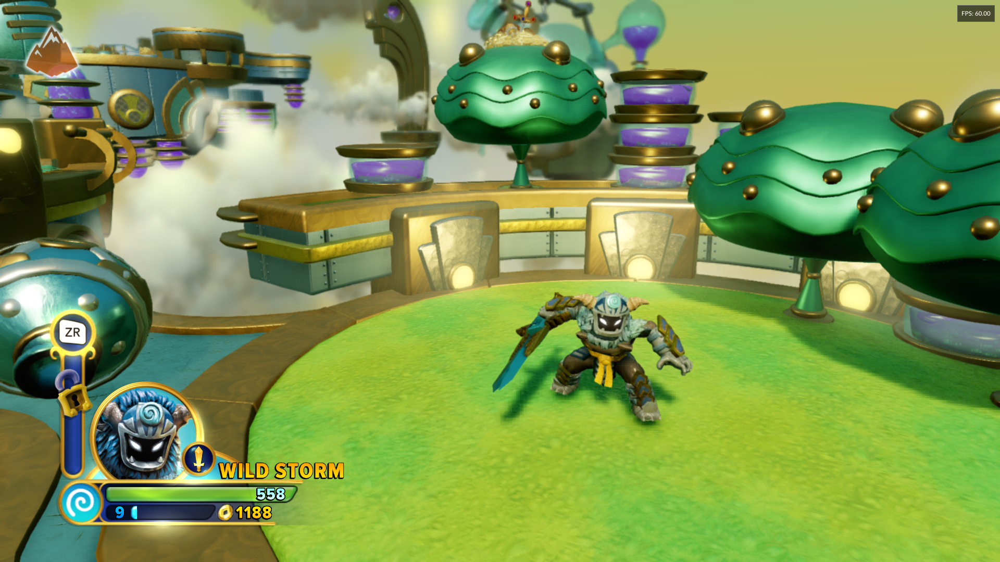 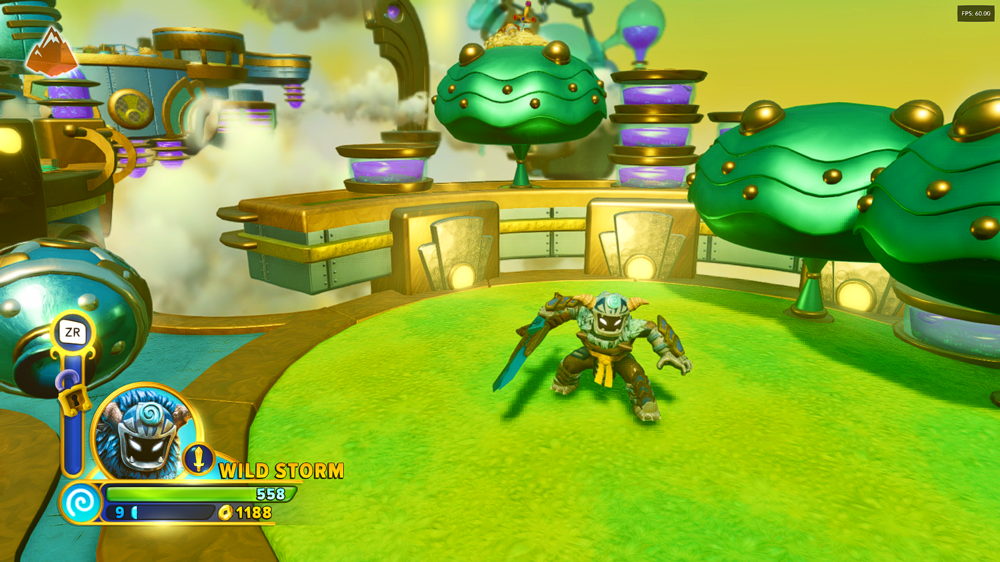

>Note that comparison images were taken at an earlier date. They may not fully reflect the final product. Apologies!

##  🚀 Recommended Emulator Tips

To get the best results from these presets, here are some settings you can tweak within the emulator:

* **Disable Depth Of Field (DoF) And Force Anisotropic Filtering If Your Emulator Allows:** 
Skylanders has a lot of ground textures that blur heavily in the distance on native hardware, especially with Depth of Field enabled. Turning off Depth of Field and forcing 16x AF works beautifully alongside ReShade's sharpness filters and will result in a clearer picture. 
>Note that some of the later Skylanders games (Superchargers, Imaginators) **do not have DoF removal graphics packs.** Additionally, from my testing, Anisoptropic Filtering is awkward to set up on Cemu with the Vulkan backend, and may require a patch to get fully working. If you cannot disable DoF or enable Anisotropic Filtering, unfortunately you will have to wait for a dedicated graphics pack to release that addresses those issues.

* **Mind The Widescreen Hacks:** 
If you're emulating the older Nintendo Wii or PS3 versions of *Spyro's Adventure* or *Giants*, use your emulator's built-in game patches/widescreen codes rather than forcing a 16:9 stretch option in the video settings. Forcing a stretch will cause UI-based shaders to distort.

* **Cache Your Shaders:** 
Turn on **Asynchronous Shader Compilation** (or Ubershaders in Dolphin). This prevents the emulator from stuttering while it loads both the game's native shaders and ReShade's post-processing at the same time.

* **Disable Emulator Anti-Aliasing:**
Don't enable **MSAA, SSAA, or FXAA** inside your emulator's graphics settings. These presets already feature optimized anti-aliasing directly from ReShade. Layering emulator-based AA on top can cause rendering conflicts, break depth detection, and cause a major loss of performance.

* **Disable Emulator Post-Processing:**  
Turn off any post-processing effects the emulator applies. Let ReShade and the presets handle the image adjustment so the two don't stack and ruin the picture.

## 🔧 Troubleshooting

#### Q: The game crashes on startup or ReShade doesn't appear.
* **Fix:** You likely selected the wrong Graphics Backend during the ReShade installation, or have recently switched your graphics backend in your emulator. Double check your emulator's settings (e.g., Dolphin, RPCS3, Cemu) to see if it is set to **Vulkan, OpenGL, or DirectX**. If it doesn't match the backend of your ReShade installation, it won't run. Run the ReShade installer again and be sure to select the correct **graphics backend.**

#### Q: The ReShade menu text is incredibly tiny and unreadable.
* **Fix:** This happens on 4K displays or high-density screens. Open the ReShade menu, hold down the **Ctrl** key on your keyboard, and **scroll your mouse wheel** to scale the UI to the correct size.

#### Q: My framerate drops significantly on a low-end PC or handheld device (Steam Deck/ROG Ally).
* **Fix:** I designed these presets to be lightweight, but some shaders (like `AmbientLight.fx`) require more GPU power than others. If you're experiencing frame drops or performance issues with these presets enabled, try disabling some effects in the ReShade menu until performance settles. 

## 💖 Credits 

### Tools Used:
* **Core Platform:** Built using the [ReShade Frame Post-Processor](https://reshade.me/) by Crosire
* [Standard ReShade Shaders](https://github.com/crosire/reshade-shaders) by Crosire and the ReShade community
* [SweetFX](https://github.com/CeeJayDK/SweetFX) by CeeJayDK
* [GShade Shaders for ReShade](https://github.com/Mortalitas/GShade-Shaders) by Marot Mortalitas
* [FXShaders](https://github.com/luluco250/FXShaders) by luluco250
* [brussell Shaders](https://github.com/brussell1/Shaders) by brussell1

**Inspired by *[Skylandeer's](https://youtube.com/@theskylandeer?si=zBLqFtAdDJ_o9pFC)* Skylanders Remastered livestreams**
Watch Both Streams Here:
- [Skylanders Spyro's Adventure with Remastered Graphics](https://www.youtube.com/live/cGGtU1aZwJc?si=-GAp8JpALTObQ8IP)
- [Skylanders Giants with Remastered Graphics](https://www.youtube.com/live/UuzO6OxHiiE?si=NY4ydFXaLrMVEAHX)

**Created by *synOptix* for the Skylanders Community**
